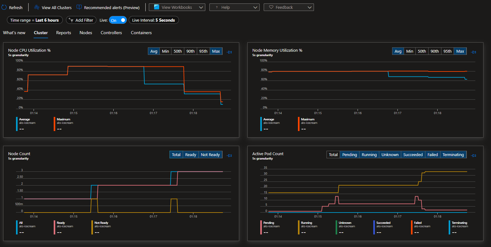

# AKS Autoscaler Metrics

Observability and Auto Scaling for AKS with Terraform with the following logging and metrics configuration:

- Container Insights
- ContainerLogV2
- Log Analytics Workspace
- OMS Agent
- Monitoring Metrics Publisher

Container Insights live dashboard:



## Deploy

```sh
terraform -chdir='infrastructure' init
terraform -chdir='infrastructure' apply -auto-approve
```

Once done get the credentials:

```sh
az aks get-credentials -n aks-icecream -g rg-icecream
```

Test the metrics components:

```sh
# Confirm agent deployment
kubectl get ds omsagent --namespace=kube-system

# Confirm solution deployment
kubectl get deployment omsagent-rs -n=kube-system
```

Set Container Insights to use ContainerLogV2:

```sh
kubectl apply -f container-azm-ms-agentconfig.yaml
```

Setup ContainerLogV2 to [Basic Logs](https://docs.microsoft.com/en-us/azure/azure-monitor/logs/basic-logs-configure?tabs=portal-1%2Cportal-2) to save costs.

```sh
az monitor log-analytics workspace table update --resource-group 'rg-icecream'  --workspace-name 'log-icecream' --name 'ContainerLogV2'  --plan 'Basic'
```

Deploy to Kubernetes:

```sh
kubectl apply -f kubernetes.yaml
```

Service should be running on the external address:

```sh
curl 'http://<CLUSTER_EXTERNAL_IP>:30000/api/icecream/5'
```

That's it 👍 services should be ready for load testing.


## Auto Scaling Load Testing

Check autoscaler status:

```
kubectl describe configmap --namespace kube-system cluster-autoscaler-status

AzureDiagnostics
| where Category == "cluster-autoscaler"
```

To load test it with K6 on Docker:

```sh
docker run \
  -e "CLUSTER_EXTERNAL_IP=<EXTERNAL_IP>" \
  -e "API=/api/fibonacci/40" \
  -e "VUS=10" \
  -e "DURATION=300s" \
  -e "K6_SLEEP=1" \
  --rm -i grafana/k6 run - <k6.js
```

Watch for the autoscale behavior on HPA:

```sh
kubectl get hpa
```

Watch for AKS autoscaler:

```sh
kubectl describe configmap --namespace kube-system cluster-autoscaler-status
```

## App Development

Make sure you're in the app directory:

```sh
cd app
```

Set up the local environment:

```sh
cp config/example.env .env
```

Start the Rust server:

```sh
cargo build
cargo run
```

Test the app:

```sh
curl 'http://localhost:8080/api/icecream/5'
```


### With Docker

```sh
docker build -t icecream .
docker run -it -p 8080:8080 --rm --name icecream icecream 
```

### Kubernets Image Refresh

If you upload a new image simply force a pull with this:

```sh
kubectl rollout restart deployment/icecream-deployment
```

## Reference

```
https://docs.microsoft.com/en-us/azure/aks/monitor-aks
https://docs.microsoft.com/en-us/azure/azure-monitor/containers/container-insights-onboard
https://docs.microsoft.com/en-us/azure/aks/tutorial-kubernetes-scale?tabs=azure-cli
```
